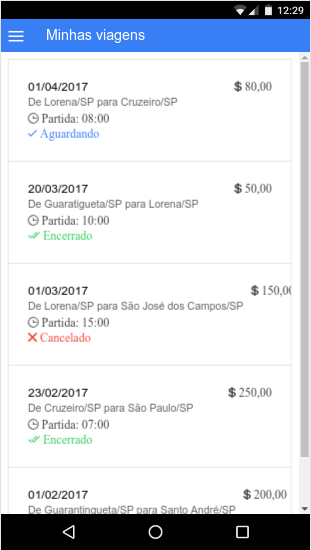
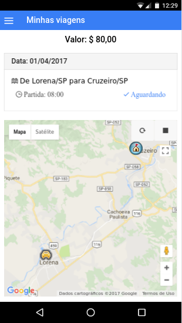

# QuickVan Ionic Mobile

Protótipo da versão mobile do aplicativo QuickVan

## Objetivo

> Permitir que os clientes acompanhem pelo mapa no celular onde o veículo contratado.

## Stack

- [Ionic](https://ionicframework.com/docs/v1/)
- [AngularJS](https://angularjs.org/)
- [ngCordova](http://ngcordova.com/)
- [Pusher](https://pusher.com/)
- [GoogleMapsApi](http://angular-ui.github.io/angular-google-maps/)

## Interface

- Tela para visualizar todas as viagens relacionada ao cliente.

  

- Tela para visualizar onde está o veículo contratado.

  
